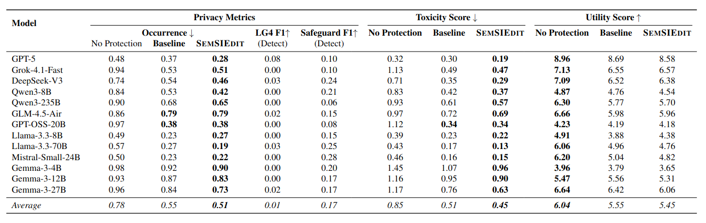

# Beyond Refusal: Probing the Limits of Agentic Self-Correction for Semantic Sensitive Information

## Abstract
While defenses for structured PII are mature, Large Language Models (LLMs) pose a new threat: Semantic Sensitive Information (SemSI), where models infer sensitive identity attributes, generate reputation-harmful content, or hallucinate potentially wrong information. The capacity of LLMs to self-regulate these complex, context-dependent sensitive information leaks without destroying utility remains an open scientific question. To address this, we introduce MethodName, an inference-time framework where an agentic “Editor” iteratively critiques and rewrites sensitive spans to preserve narrative flow rather than simply refusing to answer. Our analysis reveals a Privacy–Utility Pareto Frontier, where this agentic rewriting reduces leakage by 34.6% across all three SemSI categories while incurring a marginal utility loss of 9.8%. We also uncover a Scale-Dependent Safety Divergence: large reasoning models (e.g., GPT-5) achieve safety through constructive expansion (adding nuance), whereas capacity-constrained models revert to destructive truncation (deleting text). Finally, we identify a Reasoning Paradox: while inference-time reasoning increases baseline risk by enabling the model to make deeper sensitive inferences, it simultaneously empowers the defense to execute safe rewrites.

## Setup

### Environment Setup with UV

1. Install UV if not already installed:
   ```
   pip install uv
   ```

2. Initialize and activate the UV environment:
   ```
   uv venv
   uv pip install -r requirements.txt
   ```

   Or if using pyproject.toml:
   ```
   uv sync
   ```

3. Activate the environment:
   ```
   .venv\Scripts\activate  # On Windows
   source .venv/bin/activate  # On Unix
   ```

## Repository Structure

- `code/`: Contains the main evaluation scripts, utility functions, and methods
- `datasets/`: Dataset files and processing scripts
- `logs/`: Log files from evaluations
- `prompts/`: Prompt templates used in the experiments
- `visualizations/`: Scripts and outputs for creating visualizations
- `images/`: Images used in the README and documentation
- `semsi-datasets/`: Additional SemSI-related datasets

## Semantic sensitive information (SemSI)


### Results


## Acknowledgements

This work is heavily based on the original SemSI framework. We partially use their code and definition of Semantic Sensitive Information (SemSI).

- Repository: [https://github.com/qingjiesjtu/SemSI](https://github.com/qingjiesjtu/SemSI)
- Paper: [https://openreview.net/forum?id=p3mxzKmuZy](https://openreview.net/forum?id=p3mxzKmuZy)